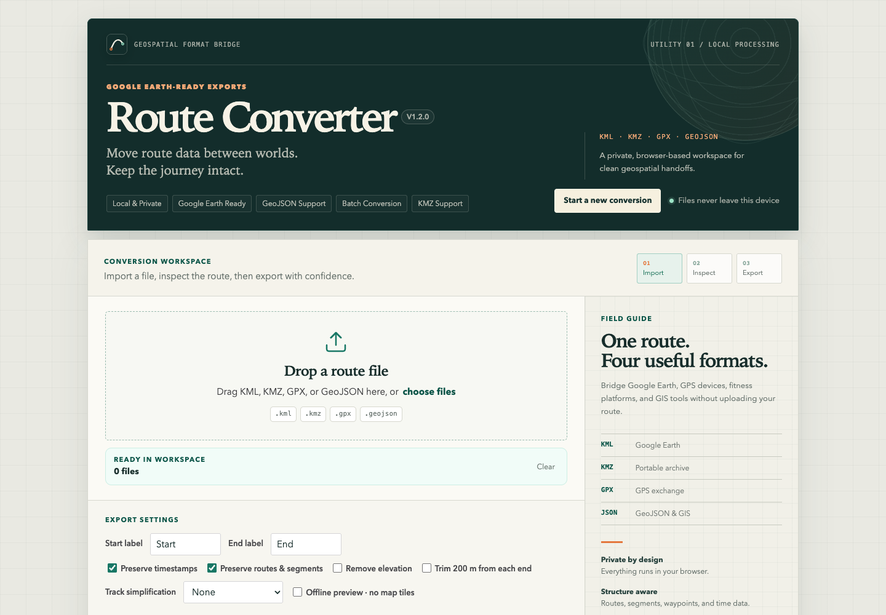

# KML / KMZ / GPX 互转工具

纯前端 Web 工具，在浏览器本地完成 **KML**、**KMZ**、**GPX** 三种格式互转。适合把运动轨迹、Google Earth 路线和 GPS 路点文件快速转换成可下载的新文件。

当前版本：**V1.1.1**



## 快速开始

直接用浏览器打开 `index.html` 即可使用。若浏览器限制本地文件访问，建议启动一个本地静态服务器：

```bash
python3 -m http.server 8080
```

然后访问：

```text
http://localhost:8080
```

打开页面后，将 KML、KMZ 或 GPX 文件拖入上传区，选择转换方向，点击「转换并下载」即可。

## 功能概览

- **三格式互转**：支持 KML、KMZ（含 KML 的 ZIP）、GPX 相互转换；可选 GPX→KML、GPX→KMZ、KML→GPX、KML→KMZ、KMZ→KML、KMZ→GPX。
- **多轨迹**：支持文件中多条轨迹（多 `<trk>` / `<rte>` / LineString / `gx:Track`），每条都有起终点。
- **预览**：选择单个文件后显示轨迹数、每条点数、起终点坐标及卫星地图预览；若仅有路点则提示「无轨迹线，仅路点」。
- **仅路点**：当文件中没有轨迹线、只有路点时，仍可转换，输出仅含路点。
- **批量**：一次选择多个 KML/KMZ/GPX 文件，逐条转换后，在「批量结果」中为每个文件提供独立下载。
- **导出选项**：可自定义起点/终点名称，并可勾选「保留时间戳」。

## 支持格式

| 输入 | 支持内容                                           |
| ---- | -------------------------------------------------- |
| GPX  | `trk` / `trkseg` / `trkpt`、`rte` / `rtept`、`wpt` |
| KML  | `LineString`、`gx:Track`、`Point` Placemark        |
| KMZ  | 包含 `.kml` 文件的 KMZ 压缩包                      |

输出为标准 KML、GPX 或包含 `doc.kml` 的 KMZ。

## 使用方式

1. 将 KML、KMZ 或 GPX 文件拖放到上传区，或点击选择文件（可多选）。
2. 在「导出选项」中设置起点/终点名称及是否保留时间戳。
3. 选择转换方向；保留「自动」时会根据文件类型选择默认方向。
4. **单文件**：点击「转换并下载」得到转换后的文件，并在「预览」中查看解析结果与卫星地图。
5. **多文件**：在「批量结果」中为每个文件点击「下载」即可逐一下载。

转换在本地完成，文件不会上传到任何服务器。

## 示例文件

`examples/` 目录提供了两个可公开的手动测试文件：

- `examples/basic.gpx`
- `examples/basic.kml`

可以直接拖入页面验证单文件转换、地图预览和起终点输出。

## 隐私说明

- 文件解析、转换、KMZ 解压与打包均在当前浏览器本地完成。
- 本项目没有后端服务，不会主动上传用户选择的 KML/KMZ/GPX 文件。
- Leaflet 与 JSZip 已本地化在 `vendor/` 目录，页面运行不再依赖 CDN 加载脚本或样式。
- 地图预览会加载第三方地图瓦片；如果不希望请求地图服务，可以断网使用转换功能。

## 本地验证

启动本地静态服务器后访问：

```text
http://localhost:8080/tests/parser-builder.html
```

页面显示 `OK` 即表示解析/生成核心用例通过。

也可以先做 JavaScript 语法检查：

```bash
node --check js/parser.js
node --check js/builder.js
node --check js/app.js
```

GitHub Actions 会在 `main` 推送和 Pull Request 时运行基础校验。

## 项目结构

```
kml-gpx-converter/
├── .github/          # Issue / PR 模板与 CI workflow
├── index.html        # 单页 UI
├── css/style.css     # 布局与样式
├── examples/         # 可公开的手动试用样例
├── js/
│   ├── parser.js     # KML/GPX 解析 → { tracks, waypoints }
│   ├── builder.js    # { tracks, waypoints } → KML/GPX 字符串
│   └── app.js        # 文件选择、预览、批量、KMZ、下载
├── vendor/           # 本地化 Leaflet / JSZip 运行时依赖
├── tests/            # 浏览器测试页和 fixtures
├── CONTRIBUTING.md
├── CHANGELOG.md
├── LICENSE
├── SECURITY.md
├── VERSION
└── README.md
```

## 贡献与安全

- 贡献指南见 `CONTRIBUTING.md`。
- 安全问题报告方式见 `SECURITY.md`。
- 第三方依赖版本与来源见 `vendor/THIRD_PARTY.md`。

## 浏览器兼容性

建议使用当前版本的 Chrome、Edge、Safari 或 Firefox。项目依赖以下浏览器能力：

- `FileReader`
- `DOMParser`
- `Blob` / `URL.createObjectURL`
- `Promise`
- `fetch`（仅测试页读取 fixtures 使用）

## 已知限制

- KML 样式、图标、文件夹层级、Track/Route 名称等元数据不会完整保留。
- GPX 输出当前以 `trk` 和 `wpt` 为主，不会恢复为原始 `rte` 结构。
- KMZ 输出目前只打包生成的 `doc.kml`，不会保留原 KMZ 中的图片、图标或其他资源。
- 地图预览依赖网络瓦片服务，离线时仍可转换但无法显示卫星底图。

## 许可证

MIT License，详见 `LICENSE`。
